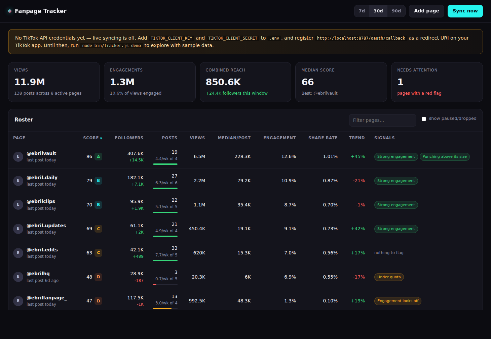

# TikTok Fanpage Tracker

A dashboard for reviewing every fan page that posts your content: what they
published, how it performed, whether they are keeping to the cadence they
agreed to, and which pages are quietly falling off.

Runs on plain Node 22 — **no dependencies, no build step, no install**.

```bash
node bin/tracker.js demo     # seed sample data so you can look around
node bin/tracker.js serve    # http://localhost:8787
```



---

## What it measures

Per page, over a rolling 7 / 30 / 90 day window:

| Metric | Definition | Why it's here |
| --- | --- | --- |
| **Views** | Sum of views on posts published in the window | Raw output |
| **Median views/post** | Median, not mean | One viral clip shouldn't hide twenty dead ones |
| **Engagement rate** | (likes + comments + shares) ÷ views | The standard TikTok read: did the views actually care |
| **Share rate** | shares ÷ views | The strongest signal that a clip is spreading |
| **Comment rate** | comments ÷ views | Depth of reaction — conversation, not just a tap |
| **Reach ratio** | median views ÷ followers | Whether posts travel beyond the page's own audience |
| **Posts/week vs quota** | Actual cadence against the deal you agreed | Reliability |
| **Trend** | Median views, recent half vs earlier half of the window | Direction of travel |
| **Follower growth** | Delta across the window from stored snapshots | Is the page itself growing |

### The partner score

Each page gets a 0–100 score and an A–F grade, weighted:

| Component | Weight | Based on |
| --- | --- | --- |
| Reach | 30% | Median views per post |
| Engagement | 25% | Engagement rate |
| Shareability | 15% | Share rate |
| Reliability | 20% | Cadence vs quota (70%) + how evenly spaced the posts are (30%) |
| Growth | 10% | Follower growth over the window |

Every threshold lives in `BENCHMARKS` and `SCORE_WEIGHTS` at the top of
[`src/metrics.js`](src/metrics.js) — one place to retune the whole system for
your niche.

### Signals

The Signals column surfaces what you'd otherwise have to go looking for:

- **Gone quiet** / **No posts in window** — the page stopped posting
- **Under quota** — cadence below half the agreed posts per week
- **Reach declining** / **Heating up** — median views moved sharply
- **Engagement looks off** — heavy views with under 1.5% engagement, which is
  what bought traffic tends to look like
- **Strong engagement**, **Highly shareable**, **Punching above its size** — the
  pages worth giving more content to
- **Stale data**, **Never synced**, **Sync failed** — data problems, so you
  don't mistake a broken token for a bad partner

**A note on trend:** a TikTok video keeps gathering views for days after it
lands, so comparing raw view totals between halves of a window makes every
healthy page look like it's dying. This compares *median views per post* and
excludes anything published in the last 3 days.

---

## Setup with the real TikTok API

The tracker pulls each fan page's numbers through TikTok's **Display API**, which
means each page owner authorizes your app once, via OAuth. This is the only
route that gives you accurate view counts on someone else's page without
scraping.

### 1. Create the TikTok app

1. Go to <https://developers.tiktok.com/apps> and create an app.
2. Add the **Login Kit** and **Display API** products.
3. Request these scopes:
   - `user.info.basic` — identity
   - `user.info.profile` — profile link (used to resolve the @handle)
   - `user.info.stats` — **follower counts**
   - `video.list` — **per-video view / like / comment / share counts**
4. Register your redirect URI, exactly matching `TIKTOK_REDIRECT_URI` below.
   TikTok requires HTTPS for live apps, so for local work either use the
   sandbox or point a tunnel (`cloudflared tunnel --url http://localhost:8787`)
   at this server and register the tunnel's `/oauth/callback` URL.
5. Copy the client key and secret.

> Scopes beyond `user.info.basic` generally need TikTok's app review before
> anyone outside your sandbox test users can grant them. Add your first few fan
> pages as sandbox target users to test the flow before review lands.

### 2. Configure

```bash
cp .env.example .env
# fill in TIKTOK_CLIENT_KEY, TIKTOK_CLIENT_SECRET, TIKTOK_REDIRECT_URI
```

### 3. Onboard a fan page

```bash
node bin/tracker.js serve                      # keep this running
node bin/tracker.js add @theirfanpage --quota 5
```

Send them the connect link it prints (`/connect?handle=theirfanpage`). They log
into TikTok, approve, and the tracker immediately pulls their profile stats and
recent videos. Nothing is written to their account and no posting permission is
requested — it is read-only access to their own analytics.

They can revoke at any time in TikTok under *Settings → Security → Manage app
permissions*; the page will then show a "Sync failed" signal until they
reconnect.

### 4. Keep it current

```bash
node bin/tracker.js sync     # all pages
node bin/tracker.js report   # scorecard in the terminal
```

Access tokens are short-lived and refreshed automatically. Refresh tokens
eventually expire too — when that happens the page is flagged and you resend the
connect link.

Run the sync on a schedule so the follower and view series build up. Daily is a
good default:

```cron
0 6 * * *  cd /path/to/tiktok-fanpage-tracker && /usr/bin/node bin/tracker.js sync >> sync.log 2>&1
```

Every sync stores a fresh row rather than overwriting, so history accumulates
from the day you start — the trend and growth numbers get more useful over time.

---

## Commands

```
node bin/tracker.js serve [--port N]     Dashboard (default :8787)
node bin/tracker.js sync [@handle]       Pull fresh numbers
node bin/tracker.js report [--window 30] Terminal scorecard
node bin/tracker.js add <@handle> [--quota N] [--note "..."]
node bin/tracker.js connect <@handle>    Print an authorization link
node bin/tracker.js list                 Pages and their connection state
node bin/tracker.js remove <@handle>     Delete a page and its history
node bin/tracker.js demo [--clear]       Seed or clear sample data
node --test test/*.test.js               Run the test suite
```

## HTTP API

The dashboard is a thin client over these endpoints, so anything you can see you
can also script:

```
GET    /api/report?window=30&includeDropped=false
GET    /api/pages
POST   /api/pages                 {handle, expected_posts_per_week, notes}
GET    /api/pages/:id?window=30
PATCH  /api/pages/:id             {status, notes, expected_posts_per_week}
DELETE /api/pages/:id
POST   /api/pages/:id/sync
POST   /api/sync
GET    /api/config
```

## Layout

```
bin/tracker.js     CLI
src/config.js      Env loading and settings
src/tiktok.js      TikTok API client (OAuth, Display API, Research API)
src/db.js          SQLite schema and queries (node:sqlite, no driver needed)
src/sync.js        Fetch → store, with token refresh and per-page error capture
src/metrics.js     All the engagement math — pure functions, fully tested
src/report.js      Rows → the report the dashboard and CLI render
src/server.js      HTTP server, JSON API, OAuth callback
src/demo.js        Deterministic sample data
public/            Dashboard (vanilla JS, hand-rolled SVG charts)
test/              Unit tests for the metrics, integration tests for the API
```

Data lives in `data/tracker.db` (git-ignored). Four tables carry history:
`pages`, `snapshots` (profile stats per sync), `posts`, and `post_metrics`
(per-video stats per sync).

## Limits worth knowing

- **The Display API only reports a page's own videos.** It cannot tell you which
  of their posts feature your content — if you need that split, filter on
  caption or hashtag in `src/report.js`.
- **No demographics or watch-time.** Audience breakdowns and average watch time
  are not exposed by the Display API; they live only in the page owner's
  in-app analytics.
- **Metrics are as of the last sync**, not live. A video's counts keep climbing
  after you read them, which is why history is stored per sync.
- **The Research API fallback** (`TIKTOK_RESEARCH_ENABLED=true`) reads public
  videos for a handle without their authorization, but needs its own TikTok
  approval and does not return follower counts.
- Single-user tool: the server has no authentication. Run it locally, or put it
  behind auth before exposing it — it holds fan pages' access tokens.
